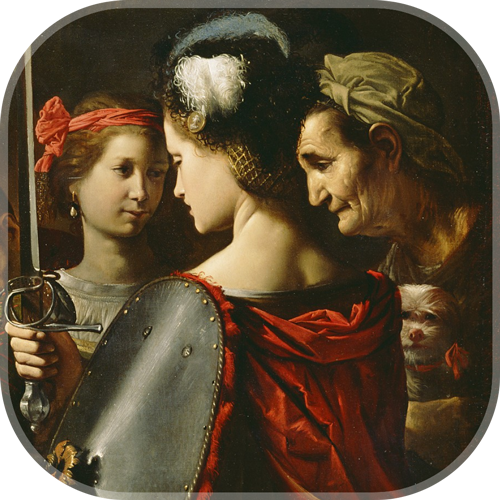

##  
# Museum Walk App
Museum Walk - pet-project application, that shows the museum's upcoming event, allows users to plan their visit by adding event to their calendar. App is localized into English, French and Russian, supports any screen orientation, can be opened via deeplink, has build-in Google Firebase Crashlytics, uploaded to TestFlight Internal Testing.

## Architectural pattern
- [x] MVP + Router

## Frameworks
- [x] Firebase Crashlytics

## Technologies
- [x] UIKit
- [x] EventKit
- [x] Storyboards
- [x] Localizations: English, French, Russian
- [x] Design moved from Figma
- [x] Custom views by code with @IBDesignable and @IBInspectable
- [x] JSON service
- [x] Generics
- [x] Font styles
- [x] Localized errors
- [x] UI tests
- [x] Deep link
- [x] Customized animation
- [x] TestFlight internal testing

## Code patterns
- [x] Async/await
- [x] Builder
- [x] Singleton
- [x] Target-Action
- [x] Delegate

## Screenshots
   

## Contact me
[LinkedIn](https://www.linkedin.com/in/bytepixelmelody "https://www.linkedin.com/in/bytepixelmelody") | [Telegram](https://t.me/BytePixelMelody "@BytePixelMelody") | [Email](mailto:bytepixelmelody@gmail.com "bytepixelmelody@gmail.com")