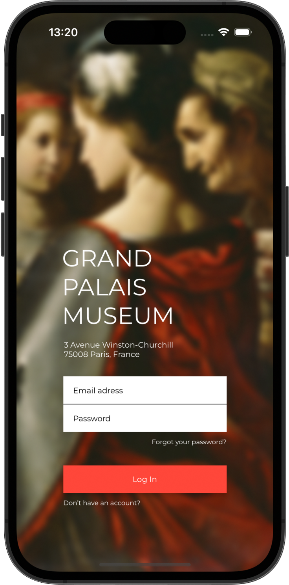
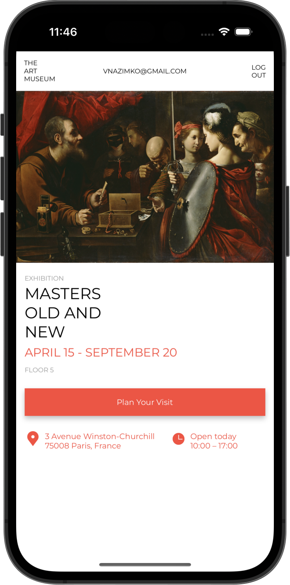

![Platform][platform-image]

# Museum App

## Architecture
- [x] MVP 

## Technologies
- [x] UIKit
- [x] Figma's ready-made design
- [x] JSON service
- [x] SceneDelegate login check
- [x] Generics
- [x] Storyboard Interface Builder
- [x] Views by code with @IBDesignable and @IBInspectable
- [x] Constraints by code and Storyboard
- [x] Adobe Photoshop for precise screenshots

## Code patterns
- [x] Singletone
- [x] Target-Action
- [x] Delegate

 

<!-- URL's -->
[platform-image]: https://img.shields.io/badge/Platform-iOS-green.svg